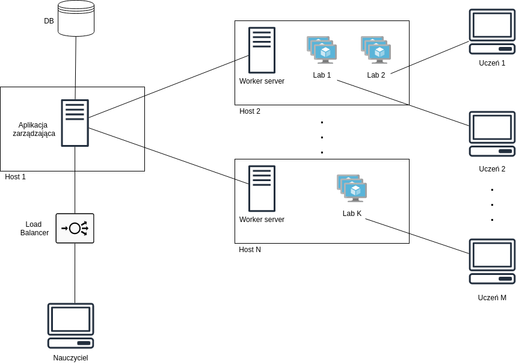

# Virtual Lab Automation

System that can be the best described as a "Lab as a Service". Project has been realized as a Bachelor's Thesis. This is only a mirror of the repository on Azure DevOps, in which the main development took place.

## "Official" Description
The subject of the work is automated creation of a laboratory, which is defined as a virtual environment with all necessary software needed to complete classes. This concept includes giving students access according to specified requirements such as limited time. At the end it also enables a teacher to download results of their work. \
As a result there is the system, which prepares and provides environments on demand (“as a Service”), described by templates. The main purpose was delivery of the environment with software for programmable networks. However, universality has been provided, so the solution can be also used to work with other technologies. \
The system also provides a scalable architecture, which enables to prepare many environments simultaneously and responds to the growing necessity of computing power. Application is also open for development and new functionalities. The solution is able to play an important role in both remote and classroom teaching.

## Concept 
System is built of the following blocks:

## Links
1. [Repository with templates](https://github.com/VM-Lab-Automation/Lab-Images)
2. [Deployment on AWS](https://github.com/VM-Lab-Automation/AWS)